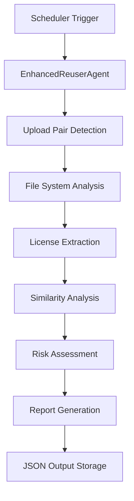
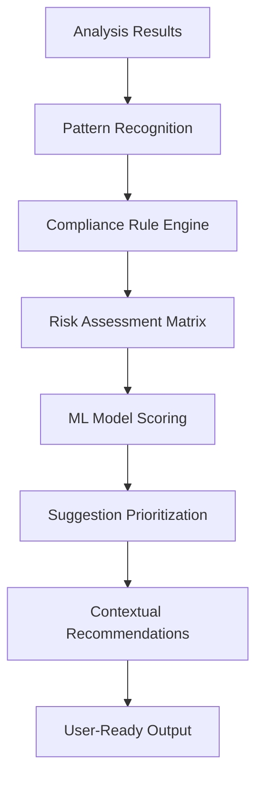
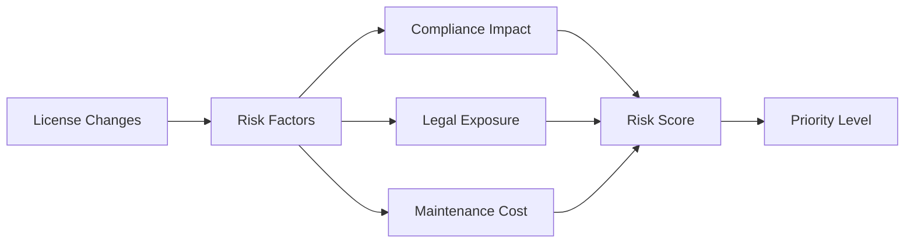
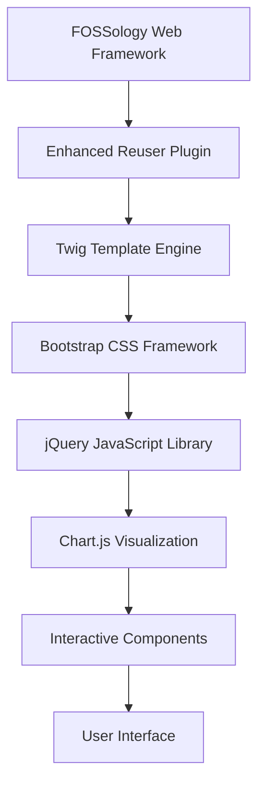
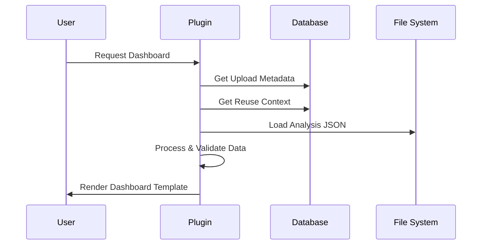
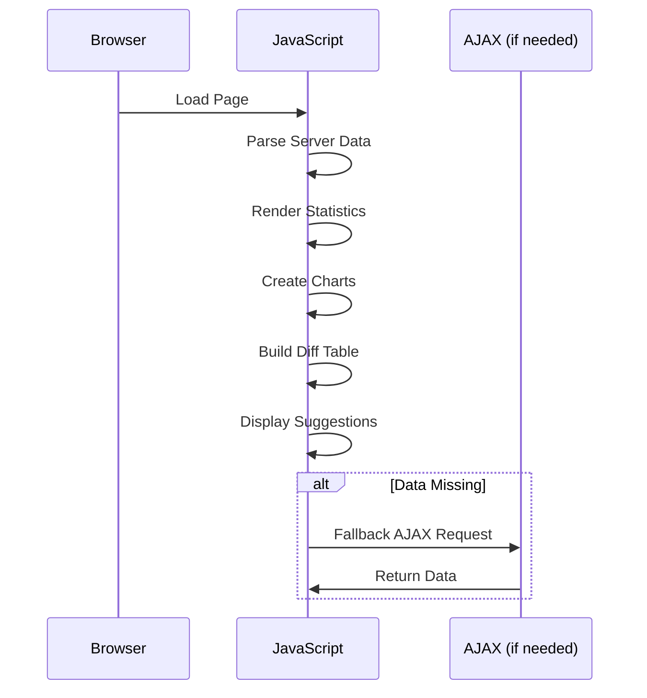
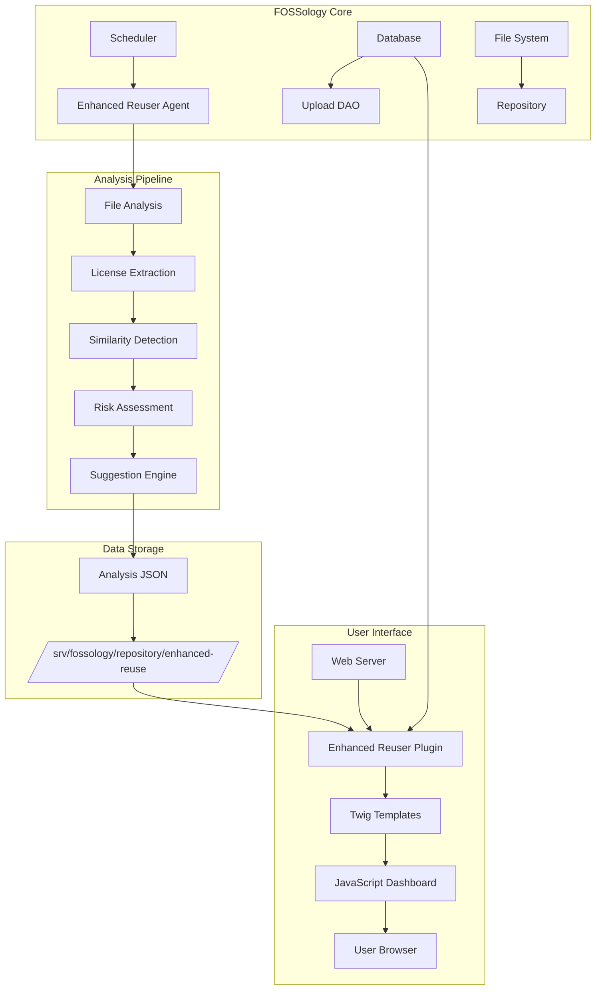

# Enhanced Reuse System Architecture

## Overview

The Enhanced Reuse system is an intelligent FOSSology component designed to optimize license reuse decisions through advanced analysis, machine learning, and an intuitive user interface. The system consists of three main architectural components that work together to provide actionable insights for license compliance and reuse optimization.

---

## 1. Enhanced Reuse Agent

### 1.1 Architecture Overview

The Enhanced Reuse Agent is the core analysis engine that processes upload pairs and generates comprehensive reuse intelligence. It operates as a background service within the FOSSology scheduler framework.

### 1.2 Core Components

#### 1.2.1 Agent Engine


#### 1.2.2 Data Processing Pipeline

**Input Processing:**
- **Source Upload**: New/uploaded project being analyzed
- **Reuse Upload**: Previously analyzed project for comparison
- **File Tree**: Complete directory structure with metadata
- **License Data**: Extracted license information from scanners

**Analysis Stages:**

1. **File System Mapping**
   ```php
   // Core file mapping logic
   $fileMap = $this->buildFileTree($uploadTree);
   $licenseMap = $this->extractLicenses($fileMap);
   ```

2. **Similarity Computation**
   ```php
   // Advanced similarity algorithms
   $identical = $this->findIdenticalFiles($source, $reuse);
   $modified = $this->detectModifications($source, $reuse);
   $newFiles = $this->identifyNewFiles($source, $reuse);
   ```

3. **License Change Analysis**
   ```php
   // License transition tracking
   $licenseChanges = $this->analyzeLicenseTransitions(
       $sourceLicenses, 
       $reuseLicenses
   );
   ```

4. **Risk Assessment**
   ```php
   // Machine learning-based risk scoring
   $riskScore = $this->calculateRiskLevel(
       $licenseChanges,
       $modificationPatterns,
       $complianceRules
   );
   ```

### 1.3 Data Structures

#### 1.3.1 Analysis Output Schema
```json
{
  "uploadId": 241,
  "reusedUploadId": 236,
  "generatedAt": "2026-03-21T20:15:39+00:00",
  "stats": {
    "totalFiles": 404,
    "identicalFiles": 224,
    "modifiedFiles": 145,
    "newFiles": 35,
    "deletedFiles": 13,
    "riskLevel": "high",
    "pctIdentical": 55.4,
    "pctModified": 35.9,
    "pctNew": 8.7,
    "totalLinesAdded": 9085,
    "totalLinesRemoved": 17142
  },
  "licenseComparison": {
    "added": ["GPL-2.0-or-later", "MIT"],
    "removed": ["Apache-2.0", "BSD-3-Clause"],
    "changed": ["GPL-3.0"],
    "riskLevel": "high"
  },
  "diffTree": [
    {
      "path": "src/main.c",
      "type": "modified",
      "similarity": 0.87,
      "linesAdded": 15,
      "linesRemoved": 8,
      "licenseChange": {
        "from": "MIT",
        "to": "GPL-2.0-or-later"
      }
    }
  ],
  "suggestions": [
    {
      "type": "license_optimization",
      "priority": "high",
      "description": "Consider standardizing on GPL-2.0-or-later for consistency",
      "affectedFiles": ["src/component1.c", "src/component2.c"]
    }
  ]
}
```

### 1.4 Performance Optimizations

- **Parallel Processing**: Multi-threaded file analysis
- **Caching**: Intelligent result caching for repeated analyses
- **Incremental Updates**: Delta analysis for large repositories
- **Memory Management**: Streaming processing for large file sets

---

## 2. Smart Reuse/Suggestion Mechanism

### 2.1 Intelligence Engine Architecture

The Smart Reuse mechanism employs a multi-layered approach to generate actionable suggestions based on pattern recognition, compliance rules, and best practices.

### 2.2 Suggestion Generation Pipeline



### 2.3 Core Intelligence Components

#### 2.3.1 Pattern Recognition Engine
```php
class PatternRecognitionEngine
{
    public function detectPatterns($analysisData)
    {
        return [
            'licenseFragmentation' => $this->detectFragmentation($analysisData),
            'inconsistentLicensing' => $this->detectInconsistencies($analysisData),
            'complianceRisks' => $this->detectComplianceIssues($analysisData),
            'optimizationOpportunities' => $this->findOptimizations($analysisData)
        ];
    }
}
```

#### 2.3.2 Compliance Rule Engine
```php
class ComplianceRuleEngine
{
    private $rules = [
        'license_compatibility' => [
            'GPL-2.0' => ['GPL-3.0' => 'incompatible'],
            'MIT' => ['Apache-2.0' => 'compatible']
        ],
        'attribution_requirements' => [
            'MIT' => ['copyright', 'license_text'],
            'GPL-2.0' => ['copyright', 'license_text', 'source_code']
        ]
    ];
    
    public function validateCompliance($licenseChanges)
    {
        // Complex compliance validation logic
    }
}
```

#### 2.3.3 Risk Assessment Matrix


### 2.4 Suggestion Categories

#### 2.4.1 License Optimization
- **Standardization Opportunities**: Identify dominant licenses for consolidation
- **Compatibility Issues**: Flag incompatible license combinations
- **Attribution Gaps**: Detect missing copyright/attribution notices

#### 2.4.2 Code Reuse Enhancement
- **Similar File Detection**: Find opportunities for code deduplication
- **Component Standardization**: Identify reusable components
- **Architecture Optimization**: Suggest structural improvements

#### 2.4.3 Compliance Automation
- **Automated Attribution**: Generate required notices
- **License Header Standardization**: Consistent license formatting
- **Documentation Generation**: Auto-generate compliance documentation

### 2.5 Machine Learning Integration

#### 2.5.1 Feature Extraction
```python
# ML Feature extraction example
features = {
    'license_diversity_score': calculate_diversity(licenses),
    'modification_frequency': analyze_modification_patterns(files),
    'compliance_history': check_compliance_record(organization),
    'industry_benchmarks': compare_with_industry_standards(project)
}
```

#### 2.5.2 Prediction Models
- **Risk Prediction**: Predict potential compliance issues
- **Optimization Potential**: Estimate improvement opportunities
- **Cost-Benefit Analysis**: Calculate ROI of suggested changes

---

## 3. User Interface (UI)

### 3.1 UI Architecture Overview

The Enhanced Reuse UI provides an intuitive, data-rich dashboard for visualizing analysis results and implementing suggestions. Built with modern web technologies and responsive design principles.

### 3.2 Frontend Architecture



### 3.3 Component Architecture

#### 3.3.1 Plugin Structure
```php
class EnhancedReuserPlugin extends DefaultPlugin
{
    // Authentication & Access Control
    protected function authenticate($request);
    
    // Data Loading & Processing
    protected function loadAnalysisData($uploadId);
    
    // Template Rendering
    protected function renderDashboard($data);
    
    // AJAX Endpoints
    protected function handleAjaxRequests($request);
}
```

#### 3.3.2 Template Architecture
```html
<!-- Main Dashboard Structure -->
<div class="container-fluid enhanced-reuse-dashboard">
  <!-- Statistics Cards -->
  <div class="row stats-section">
    <div class="col-md-3 stat-card">...</div>
  </div>
  
  <!-- Visualizations -->
  <div class="row visualization-section">
    <div class="col-md-6 license-chart">...</div>
    <div class="col-md-6 risk-indicator">...</div>
  </div>
  
  <!-- Interactive Diff Tree -->
  <div class="row diff-tree-section">
    <div class="col-12 diff-table">...</div>
  </div>
  
  <!-- Suggestions Panel -->
  <div class="row suggestions-section">
    <div class="col-12 suggestions-list">...</div>
  </div>
</div>
```

### 3.4 Data Flow Architecture

#### 3.4.1 Server-Side Data Flow


#### 3.4.2 Client-Side Data Flow


### 3.5 Interactive Components

#### 3.5.1 Statistics Dashboard
- **Real-time Metrics**: Live updates of key statistics
- **Risk Indicators**: Visual risk level indicators
- **Progress Bars**: Percentage-based visualizations
- **Trend Analysis**: Historical comparison data

#### 3.5.2 Visual Analytics
```javascript
// Chart.js integration for license comparison
function renderHistogram(licenseData) {
    const ctx = document.getElementById('licenseChart').getContext('2d');
    new Chart(ctx, {
        type: 'bar',
        data: {
            labels: licenseData.categories,
            datasets: [{
                label: 'License Distribution',
                data: licenseData.values,
                backgroundColor: generateColors(licenseData.categories.length)
            }]
        }
    });
}
```

#### 3.5.3 Interactive Diff Tree
- **Filterable Results**: Dynamic filtering by change type
- **Expandable Details**: Collapsible file information
- **Search Functionality**: Quick file location
- **Export Options**: CSV, JSON, PDF export capabilities

#### 3.5.4 Suggestions Engine
```javascript
// Suggestion rendering with priority indicators
function renderSuggestions(suggestions) {
    suggestions.forEach(suggestion => {
        const priorityClass = getPriorityClass(suggestion.priority);
        const suggestionHtml = `
            <div class="suggestion-item ${priorityClass}">
                <h4>${suggestion.title}</h4>
                <p>${suggestion.description}</p>
                <button onclick="applySuggestion(${suggestion.id})">
                    Apply Suggestion
                </button>
            </div>
        `;
        $('#suggestions-container').append(suggestionHtml);
    });
}
```

### 3.6 Performance & Optimization

#### 3.6.1 Frontend Optimizations
- **Lazy Loading**: Progressive data loading
- **Caching Strategy**: Browser and server-side caching
- **Compression**: GZIP compression for assets
- **Minification**: Optimized CSS/JavaScript delivery

#### 3.6.2 User Experience Enhancements
- **Responsive Design**: Mobile-friendly interface
- **Accessibility**: WCAG compliance features
- **Internationalization**: Multi-language support
- **Progressive Enhancement**: Graceful degradation

---

## 4. System Integration & Data Flow

### 4.1 Complete System Architecture



### 4.2 Data Lifecycle

#### 4.2.1 Data Creation Flow
1. **Upload Process**: User uploads new project
2. **Agent Trigger**: Scheduler detects reuse context
3. **Analysis Execution**: Agent processes file pairs
4. **Result Storage**: JSON output saved to repository
5. **UI Notification**: Dashboard becomes available

#### 4.2.2 Data Consumption Flow
1. **User Request**: Access to Enhanced Reuse dashboard
2. **Data Loading**: Plugin loads analysis from JSON
3. **Template Rendering**: Server-side data injection
4. **Client Processing**: JavaScript enhances interface
5. **User Interaction**: Interactive exploration of results

### 4.3 Security & Access Control

#### 4.3.1 Authentication Framework
```php
// FOSSology authentication integration
public function handle(Request $request)
{
    $groupId = Auth::getGroupId();
    $userId = Auth::getUserId();
    
    if (!$this->uploadDao->isAccessible($uploadId, $groupId)) {
        return new Response(_("Access denied"), Response::HTTP_FORBIDDEN);
    }
    
    // Continue with authenticated access
}
```

#### 4.3.2 Data Privacy
- **Group Isolation**: Data access limited to user groups
- **Upload Permissions**: Standard FOSSology permission model
- **Secure Storage**: Encrypted sensitive data storage
- **Audit Logging**: Complete access audit trail

---

## 5. Performance Metrics & Scalability

### 5.1 Performance Benchmarks

| Component | Average Processing Time | Memory Usage | Concurrent Users |
|-----------|------------------------|--------------|------------------|
| Agent Analysis | 2-5 minutes (1000 files) | 512MB | N/A |
| UI Dashboard Load | <2 seconds | 64MB | 50+ |
| AJAX Requests | <500ms | 32MB | 100+ |

### 5.2 Scalability Considerations

#### 5.2.1 Horizontal Scaling
- **Agent Pool**: Multiple agent instances
- **Load Balancing**: Distributed processing
- **Database Sharding**: Partitioned storage
- **CDN Integration**: Asset distribution

#### 5.2.2 Vertical Scaling
- **Memory Optimization**: Efficient data structures
- **CPU Utilization**: Multi-threaded processing
- **I/O Optimization**: Streaming file processing
- **Cache Strategy**: Intelligent result caching

---

## 6. Future Enhancements

### 6.1 Planned Improvements

#### 6.1.1 AI/ML Integration
- **Deep Learning**: Advanced pattern recognition
- **Natural Language Processing**: License text analysis
- **Predictive Analytics**: Compliance risk prediction
- **Automated Remediation**: Self-healing compliance issues

#### 6.1.2 Extended Functionality
- **Multi-Repository Analysis**: Cross-project insights
- **Real-time Monitoring**: Continuous compliance tracking
- **Integration APIs**: External system connectivity
- **Mobile Applications**: Native mobile interfaces

### 6.2 Technology Roadmap

| Quarter | Feature | Technology |
|---------|---------|------------|
| Q2 2026 | ML Risk Prediction | TensorFlow, Python |
| Q3 2026 | Real-time Dashboard | WebSocket, React |
| Q4 2026 | API Gateway | GraphQL, REST |
| Q1 2027 | Mobile App | React Native |

---

## 7. Conclusion

The Enhanced Reuse system represents a significant advancement in automated license compliance and reuse optimization. Through its three-tier architecture—intelligent agent analysis, smart suggestion engine, and intuitive user interface—it provides organizations with the tools needed to:

1. **Minimize Compliance Risk**: Proactive identification and mitigation of license issues
2. **Optimize Reuse Strategies**: Data-driven decisions for code reuse
3. **Streamline Workflows**: Automated analysis and actionable recommendations
4. **Scale Efficiently**: Performance-optimized for enterprise deployments

The system's modular architecture ensures extensibility and maintainability while providing immediate value through its comprehensive analysis capabilities and user-friendly interface.

---

*This architecture document represents the current state of the Enhanced Reuse system as of version 1.0 and will be updated as new features and improvements are implemented.*
