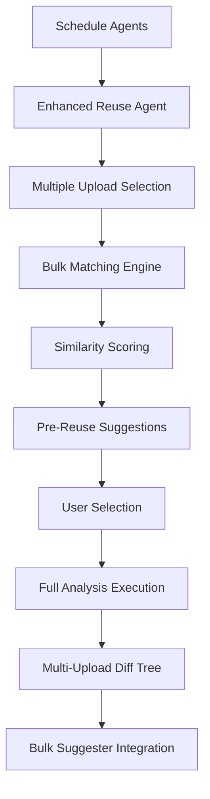
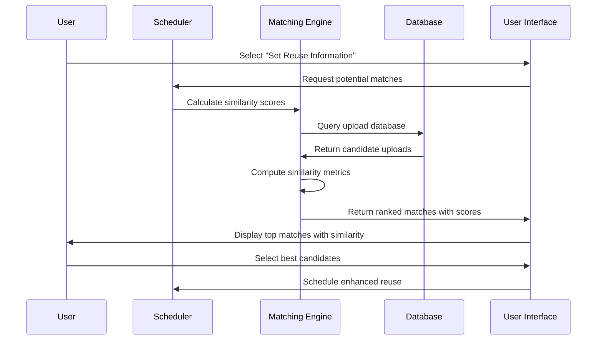

# Enhanced Reuse System Updates Based on Maintainer Feedback

## Summary of Required Changes

Based on the maintainer's feedback, the following architectural changes are needed:

### 1. **Multiple Upload Reuse Support**
- Diff tree must consider ALL selected uploads, not just one version
- Histogram should aggregate across all reuse selections
- Results should prioritize the most recent reuse selection

### 2. **Standalone Enhanced Reuse Agent**
- Create separate "enhanced-reuse" agent (not just integrated)
- Consider C++ implementation for better scalability
- Maintain compatibility with existing reuse workflow

### 3. **Pre-Reuse Suggestion System**
- Show matching uploads with similarity scores during scheduling
- Help users make informed decisions before applying reuse
- Implement fast matching for 100k+ file environments

### 4. **Bulk Suggester Feature**
- Add column for bulk suggestions in diff histogram
- Show pre-entered data for common patterns
- Allow modifications and scheduling from bulk suggestions

### 5. **Version Handling**
- Track multiple reuse executions for same upload
- Prioritize most recent results in diff tree view
- Handle FOSSology version changes gracefully

---

## Updated Architecture Components

### 1. Enhanced Agent Architecture



### 2. Pre-Reuse Suggestion Flow



### 3. Bulk Suggester Integration


---

## Implementation Plan

### Phase 1: Core Infrastructure Updates

#### 1.1 Database Schema Changes
```sql
-- Enhanced reuse tracking for multiple uploads
CREATE TABLE enhanced_reuse_execution (
    id SERIAL PRIMARY KEY,
    upload_fk INTEGER REFERENCES upload(upload_pk),
    reused_uploads TEXT[], -- Array of reused upload IDs
    execution_time TIMESTAMP,
    similarity_scores JSONB, -- Scores for each reused upload
    fossology_version VARCHAR(50),
    is_most_recent BOOLEAN DEFAULT FALSE
);

-- Bulk pattern storage
CREATE TABLE bulk_suggestion_patterns (
    id SERIAL PRIMARY KEY,
    pattern_name VARCHAR(255),
    pattern_type VARCHAR(50), -- 'license', 'copyright', 'attribution'
    pattern_content TEXT,
    frequency_count INTEGER DEFAULT 0,
    created_at TIMESTAMP DEFAULT NOW()
);

-- File pattern matches
CREATE TABLE file_pattern_matches (
    id SERIAL PRIMARY KEY,
    pfile_fk INTEGER REFERENCES pfile(pfile_pk),
    pattern_fk INTEGER REFERENCES bulk_suggestion_patterns(id),
    match_confidence FLOAT,
    match_location TEXT
);
```

#### 1.2 Enhanced Agent Structure
```cpp
// Proposed C++ Enhanced Reuse Agent
class EnhancedReuseAgent {
private:
    std::vector<UploadId> selectedUploads;
    PatternDatabase bulkPatterns;
    SimilarityEngine similarityEngine;
    
public:
    void execute(const AgentArguments& args) override;
    std::vector<MatchResult> findPotentialMatches(UploadId source);
    MultiUploadAnalysis analyzeMultipleReuses(const std::vector<UploadId>& uploads);
    BulkSuggestions generateBulkSuggestions(const AnalysisData& data);
};
```

### Phase 2: Pre-Reuse Suggestion System

#### 2.1 Fast Matching Algorithm
```cpp
class FastMatchingEngine {
private:
    // Optimized for 100k+ files
    std::unordered_map<std::string, std::vector<FileSignature>> fileIndex;
    LSHIndex licenseIndex; // Locality Sensitive Hashing for similarity
    
public:
    std::vector<MatchCandidate> findMatches(const UploadMetadata& source, 
                                       size_t maxResults = 10);
    double calculateSimilarity(const FileSignature& f1, const FileSignature& f2);
};
```

#### 2.2 UI Integration for Pre-Reuse Suggestions
```javascript
// Enhanced scheduler UI
class ReuseScheduler {
    async showPotentialMatches(uploadId) {
        const matches = await this.api.getPotentialMatches(uploadId);
        this.renderMatchTable(matches);
    }
    
    renderMatchTable(matches) {
        matches.forEach(match => {
            const row = `
                <tr>
                    <td>${match.uploadId}</td>
                    <td>${match.filename}</td>
                    <td><div class="similarity-bar" style="width: ${match.similarity}%"></div></td>
                    <td>${match.licenseCompatibility}</td>
                    <td><button onclick="selectUpload(${match.uploadId})">Select</button></td>
                </tr>
            `;
            $('#matches-table').append(row);
        });
    }
}
```

### Phase 3: Multi-Upload Diff Tree

#### 3.1 Enhanced Data Structure
```json
{
  "uploadId": 241,
  "reusedUploads": [
    {
      "uploadId": 236,
      "similarity": 0.87,
      "isSelected": true,
      "executionTime": "2026-03-21T20:15:39+00:00"
    },
    {
      "uploadId": 198,
      "similarity": 0.72,
      "isSelected": true,
      "executionTime": "2026-03-20T15:30:12+00:00"
    }
  ],
  "multiUploadStats": {
    "totalFiles": 404,
    "identicalAcrossAll": 180,
    "modifiedInAny": 145,
    "uniqueToSource": 35,
    "uniqueToReuses": 44
  },
  "diffTree": [
    {
      "path": "src/main.c",
      "type": "modified",
      "similarity": {
        "upload_236": 0.87,
        "upload_198": 0.91
      },
      "modifications": {
        "upload_236": {
          "linesAdded": 15,
          "linesRemoved": 8,
          "licenseChange": {"from": "MIT", "to": "GPL-2.0"}
        },
        "upload_198": {
          "linesAdded": 12,
          "linesRemoved": 5,
          "licenseChange": null
        }
      }
    }
  ]
}
```

#### 3.2 Updated UI Components
```javascript
// Enhanced diff tree for multiple uploads
function renderMultiUploadDiffTree(diffData) {
    diffData.forEach(item => {
        const row = `
            <tr class="diff-item">
                <td>${item.path}</td>
                <td>${item.type}</td>
                <td class="similarity-cell">
                    ${Object.entries(item.similarity)
                        .map(([uploadId, similarity]) => 
                            `<div class="upload-similarity" data-upload="${uploadId}">
                                <span class="upload-label">Upload ${uploadId}</span>
                                <div class="similarity-bar" style="width: ${similarity * 100}%"></div>
                                <span class="similarity-value">${(similarity * 100).toFixed(1)}%</span>
                            </div>`
                        ).join('')}
                </td>
                <td class="modifications-cell">
                    ${renderModifications(item.modifications)}
                </td>
            </tr>
        `;
        $('#diff-tree-table').append(row);
    });
}

function renderModifications(modifications) {
    return Object.entries(modifications)
        .map(([uploadId, mod]) => `
            <div class="upload-modifications" data-upload="${uploadId}">
                <h6>Upload ${uploadId}</h6>
                <div class="mod-stats">
                    <span class="added">+${mod.linesAdded}</span>
                    <span class="removed">-${mod.linesRemoved}</span>
                    ${mod.licenseChange ? 
                        `<div class="license-change">
                            ${mod.licenseChange.from} → ${mod.licenseChange.to}
                        </div>` : ''}
                </div>
            </div>
        `).join('');
}
```

### Phase 4: Bulk Suggester Feature

#### 4.1 Pattern Detection Engine
```cpp
class BulkPatternDetector {
private:
    std::unordered_map<std::string, PatternStats> detectedPatterns;
    
public:
    void analyzeFile(const FileContent& content);
    std::vector<BulkSuggestion> getTopPatterns(size_t limit = 50);
    void updatePatternDatabase(const std::vector<BulkSuggestion>& patterns);
};

struct BulkSuggestion {
    std::string patternName;
    std::string patternType;
    std::string content;
    size_t frequency;
    double confidence;
    std::vector<std::string> affectedFiles;
};
```

#### 4.2 Bulk Suggester UI Integration
```javascript
// Enhanced histogram with bulk suggestions
function renderEnhancedHistogram(licenseData, bulkSuggestions) {
    const ctx = document.getElementById('license-chart').getContext('2d');
    
    // Add bulk suggestion column to data
    const enhancedData = licenseData.categories.map((category, index) => ({
        category: category,
        count: licenseData.values[index],
        bulkSuggestion: bulkSuggestions.find(s => s.category === category)
    }));
    
    new Chart(ctx, {
        type: 'bar',
        data: {
            labels: enhancedData.map(d => d.category),
            datasets: [{
                label: 'License Count',
                data: enhancedData.map(d => d.count),
                backgroundColor: generateColors(enhancedData.length)
            }]
        },
        options: {
            plugins: {
                tooltip: {
                    callbacks: {
                        afterLabel: function(context) {
                            const suggestion = enhancedData[context.dataIndex].bulkSuggestion;
                            if (suggestion) {
                                return `Bulk Suggestion: ${suggestion.patternName} (${suggestion.frequency} files)`;
                            }
                            return '';
                        }
                    }
                }
            }
        }
    });
}

// Bulk suggester modal
function showBulkSuggester(pattern) {
    const modal = `
        <div class="modal fade" id="bulkSuggesterModal">
            <div class="modal-dialog">
                <div class="modal-content">
                    <div class="modal-header">
                        <h4>Bulk Suggestion: ${pattern.patternName}</h4>
                    </div>
                    <div class="modal-body">
                        <div class="form-group">
                            <label>Pattern Content:</label>
                            <textarea class="form-control" rows="6">${pattern.content}</textarea>
                        </div>
                        <div class="form-group">
                            <label>Affected Files (${pattern.affectedFiles.length}):</label>
                            <div class="file-list">
                                ${pattern.affectedFiles.map(file => 
                                    `<div class="file-item">${file}</div>`
                                ).join('')}
                            </div>
                        </div>
                    </div>
                    <div class="modal-footer">
                        <button onclick="applyBulkSuggestion(${pattern.id})" 
                                class="btn btn-primary">Apply & Schedule Scan</button>
                        <button onclick="modifyBulkSuggestion(${pattern.id})" 
                                class="btn btn-secondary">Modify</button>
                        <button onclick="closeModal()" class="btn btn-default">Cancel</button>
                    </div>
                </div>
            </div>
        </div>
    `;
    
    $('body').append(modal);
    $('#bulkSuggesterModal').modal('show');
}
```

---

## Updated System Flow

### 1. Enhanced User Workflow

```mermaid
graph TD
    A[User Uploads File] --> B[Click "Set Reuse Information"]
    B --> C[Show Potential Matches]
    C --> D[Display Similarity Scores]
    D --> E[User Selects Multiple Uploads]
    E --> F[Schedule Enhanced Reuse]
    F --> G[Agent Executes Analysis]
    G --> H[Multi-Upload Results]
    H --> I[Dashboard with Bulk Suggestions]
    I --> J[User Can Apply/Modify Suggestions]
```

### 2. Performance Optimizations

#### 2.1 Scalability Improvements
- **C++ Agent**: Better memory management and performance
- **Parallel Processing**: Multi-threaded similarity calculations
- **Index Optimization**: Fast file lookup for 100k+ files
- **Caching Strategy**: Intelligent result caching

#### 2.2 Database Optimizations
```sql
-- Optimized indexes for fast matching
CREATE INDEX idx_upload_filename_similarity ON upload(upload_filename, upload_pk);
CREATE INDEX idx_pfile_content_hash ON pfile(pfile_sha1, pfile_md5);
CREATE INDEX idx_pattern_frequency ON bulk_suggestion_patterns(frequency_count DESC);

-- Partitioned tables for large datasets
CREATE TABLE enhanced_reuse_execution_2026 PARTITION OF enhanced_reuse_execution
FOR VALUES FROM ('2026-01-01') TO ('2027-01-01');
```

---

## Migration Strategy

### Phase 1: Database Migration (Week 1-2)
1. Create new tables and indexes
2. Migrate existing data to new structure
3. Update DAO classes for new schema

### Phase 2: Agent Development (Week 3-4)
1. Develop C++ enhanced reuse agent
2. Implement fast matching engine
3. Create bulk pattern detection

### Phase 3: UI Updates (Week 5-6)
1. Update scheduler with pre-reuse suggestions
2. Enhance diff tree for multiple uploads
3. Implement bulk suggester interface

### Phase 4: Integration & Testing (Week 7-8)
1. End-to-end testing
2. Performance benchmarking
3. Documentation updates

---

## Files to Modify

### Core Agent Files
- `src/enhancedreuser/agent/EnhancedReuserAgent.php` → `src/enhancedreuser/agent/EnhancedReuseAgent.cpp`
- `src/enhancedreuser/agent/EnhancedReuseAgent.cpp` (new)
- `src/enhancedreuser/agent/FastMatchingEngine.cpp` (new)
- `src/enhancedreuser/agent/BulkPatternDetector.cpp` (new)

### UI Files
- `src/enhancedreuser/ui/EnhancedReuserPlugin.php` (update for multi-upload)
- `src/enhancedreuser/ui/template/enhanced_reuser.html.twig` (enhanced)
- `src/enhancedreuser/ui/template/enhanced_reuser.js.twig` (multi-upload support)
- `src/enhancedreuser/ui/template/bulk_suggester.html.twig` (new)

### Database Files
- `src/enhancedreuser/ui/EnhancedReuserPlugin.php` (DAO updates)
- `src/enhancedreuser/schema/tables.sql` (new schema)
- `src/enhancedreuser/schema/migration.sql` (migration script)

---

## Conclusion

These updates will transform the Enhanced Reuse system into a highly scalable, intelligent platform that can:

1. **Handle Multiple Reuse Scenarios**: Support for comparing against multiple uploads simultaneously
2. **Provide Intelligent Pre-Selection**: Help users choose the best reuse candidates
3. **Scale to Enterprise Levels**: C++ implementation for 100k+ file environments
4. **Enable Bulk Operations**: Automated pattern detection and application
5. **Maintain Performance**: Optimized algorithms and database structures

The architecture maintains backward compatibility while adding powerful new capabilities that align with the maintainer's vision for a production-ready, scalable solution.
